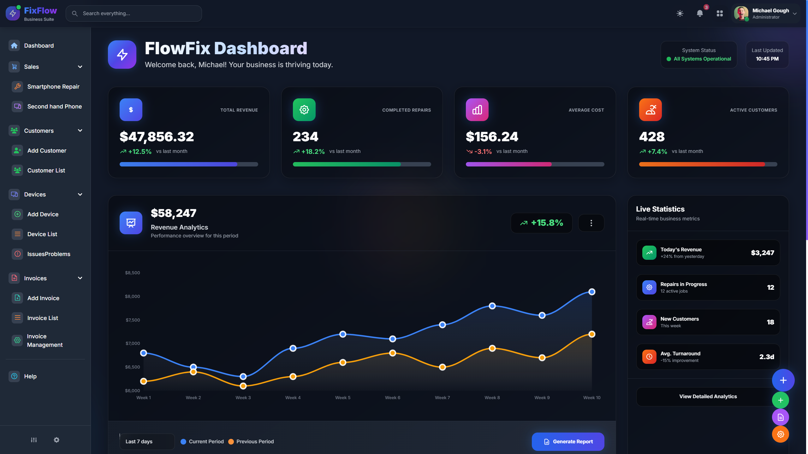
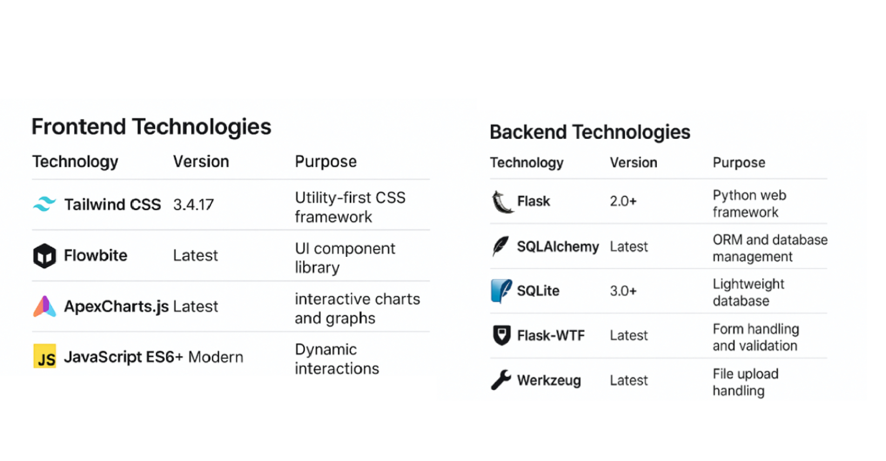
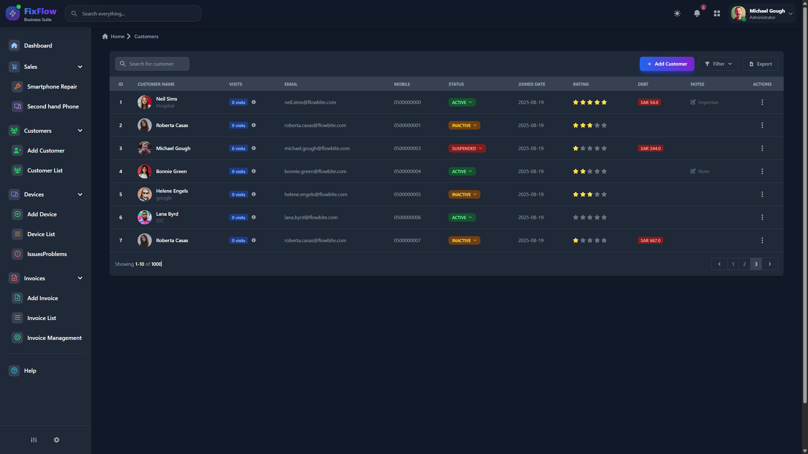
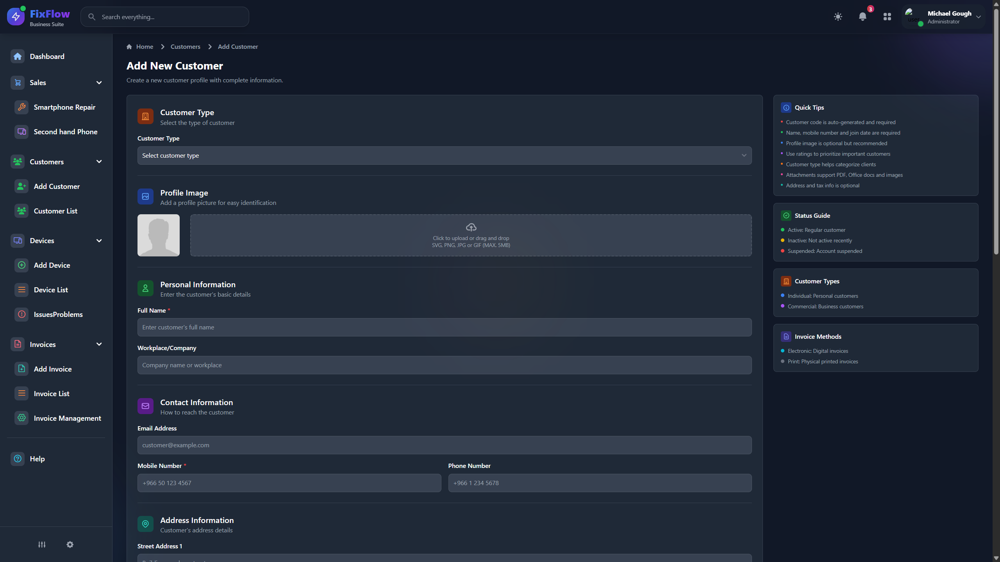
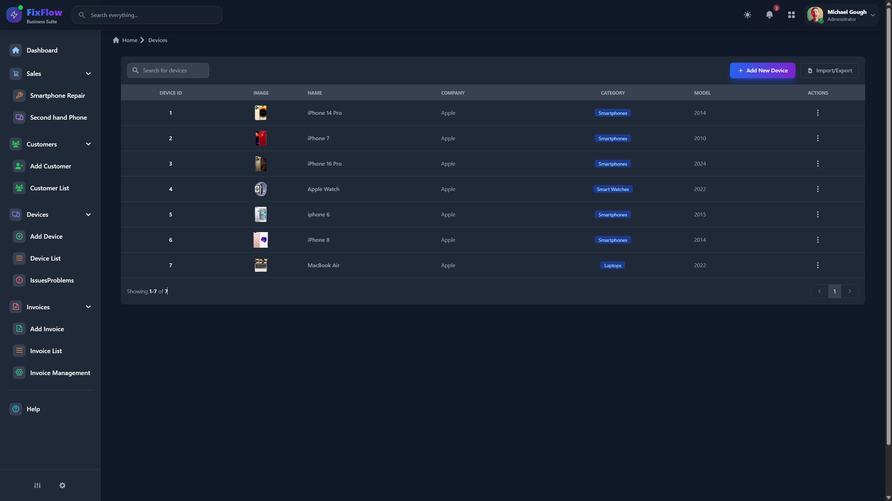
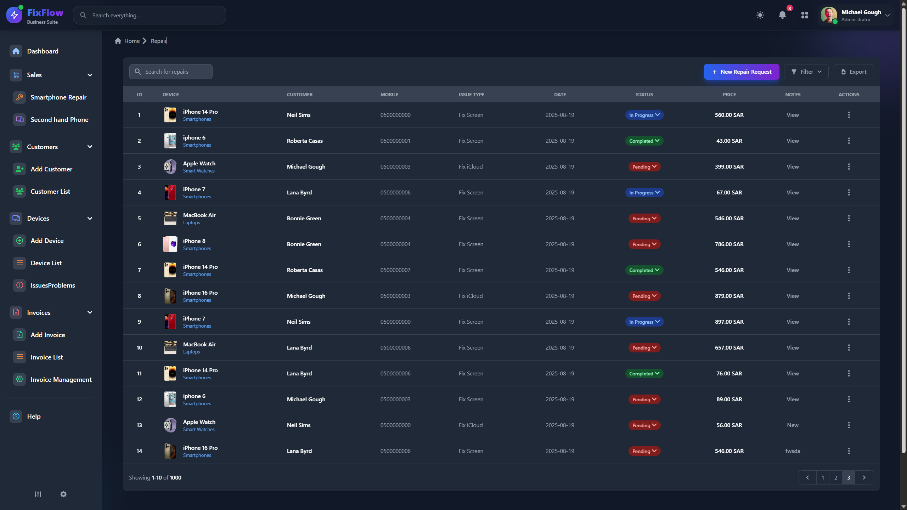
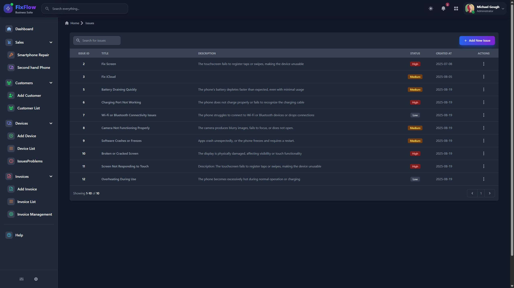
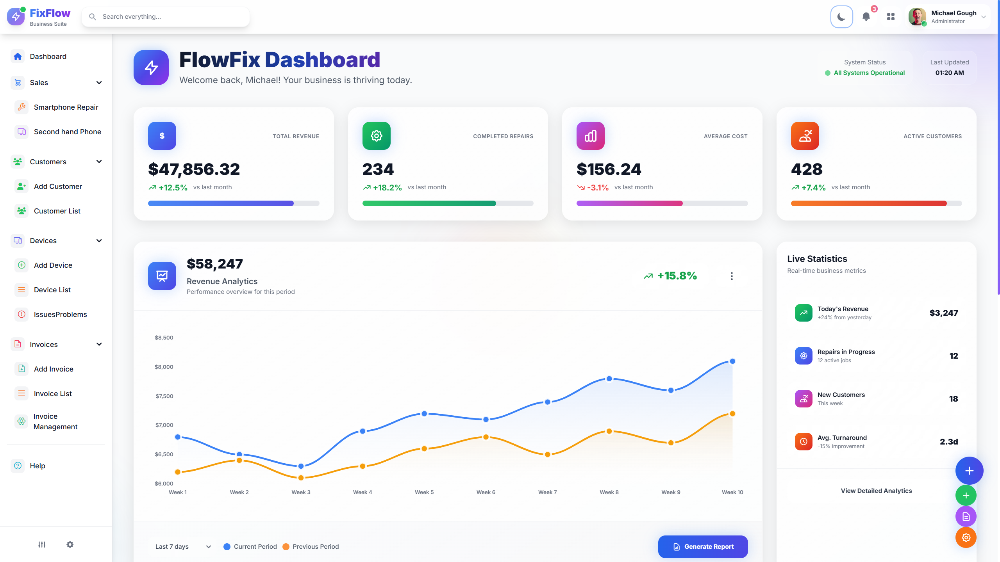
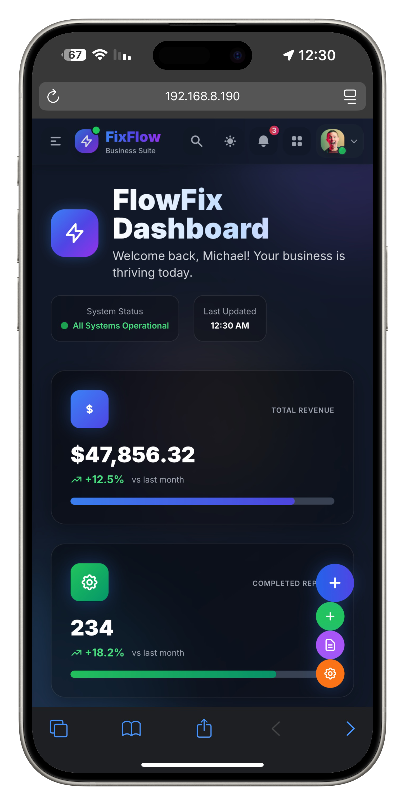
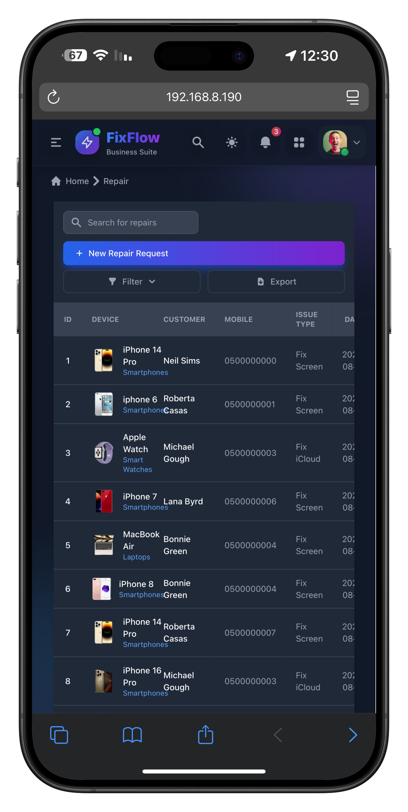

<div align="center">
  
  <h1>FixFlow</h1>
  **Version**: v5.1 Beta | **Status**: In Development | **Last Updated**: 2024
  <p><em>Smart Phone Repair Shop Management System</em></p>
  
  [](LICENSE)
  [](https://python.org)
  [](https://flask.palletsprojects.com)
  [](https://tailwindcss.com)
  [](https://github.com/yourusername/fixflow/pulls)
  [](https://github.com/yourusername/fixflow)
  
  <strong>⚠️ IMPORTANT NOTICE: This project is currently under development and not yet complete</strong>
</div>

---

## 🎯 Overview

**FixFlow** is a comprehensive web-based management system designed specifically for smartphone repair shops. It streamlines operations, enhances customer service, and provides powerful tools to manage every aspect of your repair business.



### What Problems Does FixFlow Solve?

- **Customer Management**: Track customer data, repair history, and service records
- **Device Catalog**: Comprehensive database of smartphones and their specifications  
- **Repair Tracking**: Monitor repair status from intake to completion
- **Issue Database**: Maintain a knowledge base of common problems and solutions
- **Billing System**: Generate invoices and manage payments
- **Second-Hand Trading**: Dedicated section for buying and selling used devices

### Key Benefits

✅ **Streamlined Operations** - Reduce manual paperwork and administrative overhead  
✅ **Enhanced Customer Service** - Quick access to customer history and device information  
✅ **Improved Efficiency** - Track repairs and manage workflow effectively  
✅ **Data-Driven Insights** - Analytics and reporting for business optimization  
✅ **Professional Appearance** - Modern, responsive interface that impresses customers  

---

## 🛠️ Technology Stack



### Backend Technologies

| Technology | Version | Purpose |
|------------|---------|---------|
| **Flask** | 2.0+ | Python web framework |
| **SQLAlchemy** | Latest | ORM and database management |
| **SQLite** | 3.0+ | Lightweight database |
| **Flask-WTF** | Latest | Form handling and validation |
| **Werkzeug** | Latest | File upload handling |

### Frontend Technologies

| Technology | Version | Purpose |
|------------|---------|---------|
| **Tailwind CSS** | 3.4.17 | Utility-first CSS framework |
| **Flowbite** | Latest | UI component library |
| **ApexCharts.js** | Latest | Interactive charts and graphs |
| **JavaScript ES6+** | Modern | Dynamic interactions |
| **Inter Font** | Latest | Typography |

### Development Tools

- **Node.js** - JavaScript package management
- **PostCSS** - CSS processing and optimization  
- **npm** - Dependency management
- **Blueprint Architecture** - Modular Flask structure

---

## 📱 Features & Pages


### ✅ Completed Features

#### 1. Dashboard (`index.html`)
**Status**: ✅ Complete (90%)

)

- Interactive analytics dashboard
- Quick statistics overview
- Dynamic charts and graphs
- Recent activity feed
- Task management panel

#### 2. Customer Management (`customers.html`)
**Status**: ✅ Complete (100%)



- Comprehensive customer database
- Advanced search and filtering
- Customer profile management
- Photo upload capabilities
- Star rating system
- Debt tracking
- Contact information management
- Document attachments

#### 3. Add New Customer (`add_customer.html`)
**Status**: ✅ Complete (100%)




- Comprehensive customer intake form
- Profile photo upload
- Contact information fields
- Detailed address management
- Business information tracking
- Document attachment system
- Rating and notes system

#### 4. Device Management (`devices.html`)
**Status**: ✅ Complete (100%)



- Complete device catalog
- Device categorization
- Technical specifications
- Image upload for devices
- Search and filter functionality
- Brand and model management

#### 5. Repair Management (`smartphone_repair.html`)
**Status**: ✅ Complete (95%)



- Repair order creation
- Customer and device linking
- Issue type classification
- Status tracking system
- Pricing management
- Detailed notes and comments
- Timeline tracking

#### 6. Issue Management (`issues.html`)
**Status**: ✅ Complete (100%)



- Issue database management
- Priority classification
- Problem categorization
- Search functionality
- Solution tracking
- Edit and delete capabilities

---

### ⚠️ Partially Complete Features

#### 7. Second-Hand Phones (`second_hand_phones.html`)
**Status**: ⚠️ Basic Structure (15%)


**Available:**
- Customer selection interface
- Basic customer details display
- Simple analytics chart

**Missing:**
- Used phone inventory management
- Dynamic pricing system
- Buy/sell transaction handling
- Device condition assessment
- Profit/loss tracking

#### 8. Billing System (`sales/new_invoice.html`)
**Status**: ⚠️ Basic Template (20%)


**Available:**
- Customer selection
- Basic product table structure

**Missing:**
- Tax calculations
- Invoice printing functionality
- Invoice storage system
- Payment tracking
- Sales reporting

---


### Design Highlights

- **Responsive Design** - Works perfectly on desktop, tablet, and mobile
- **Dark/Light Mode** - Toggle between themes for user preference
- **Modern Aesthetics** - Clean, professional appearance
- **Intuitive Navigation** - Easy-to-use sidebar and navigation system
- **Interactive Elements** - Smooth animations and transitions
- **Accessibility** - Designed with usability in mind

### Visual Features

- **Interactive Charts** - Real-time data visualization
- **Modal Windows** - Efficient data entry and editing
- **Toast Notifications** - User feedback for actions
- **Loading States** - Professional loading indicators
- **Form Validation** - Real-time input validation
- **Image Galleries** - Beautiful image display systems

---

## 🚀 Quick Start


### Prerequisites

```bash
Python 3.7 or higher
Node.js (for development)
Git
```

### Installation Steps

#### 1. Clone the Repository
```bash
git clone https://github.com/iiiYar/FixFlow-bv5.1
cd fixflow
```

#### 2. Set Up Python Environment
```bash
# Create virtual environment
python -m venv venv

# Activate virtual environment
# Windows:
venv\Scripts\activate
# Linux/Mac:
source venv/bin/activate

# Install Python dependencies
pip install -r requirements.txt
```

#### 3. Set Up Database
```bash
# Initialize database
python -c "from app import create_app, db; app = create_app(); app.app_context().push(); db.create_all()"
```

#### 4. Install Frontend Dependencies (Optional)
```bash
# Install Node.js dependencies
npm install

# Run Tailwind CSS in watch mode (for development)
npm run watch
```

#### 5. Run the Application
```bash
python run.py
```

#### 6. Access the Application
```
http://localhost:5000
```


---

## 📊 Project Status


### Feature Completion Status

| Feature | Status | Completion |
|---------|--------|------------|
| **Customer Management** | ✅ Complete | 100% |
| **Device Management** | ✅ Complete | 100% |
| **Repair Tracking** | ✅ Complete | 95% |
| **Issue Management** | ✅ Complete | 100% |
| **Dashboard** | ✅ Complete | 90% |
| **User Interface** | ✅ Complete | 95% |
| **Billing System** | ❌ Incomplete | 20% |
| **Second-Hand Trading** | ❌ Incomplete | 15% |
| **Reporting** | ❌ Incomplete | 10% |
| **Security System** | ❌ Incomplete | 5% |
| **Inventory Management** | ❌ Incomplete | 0% |
| **Backup System** | ❌ Incomplete | 0% |

### **Overall Project Completion: 60%**

---

## 📋 Detailed Feature Analysis

### ✅ Completed Features

#### Customer Management System
- ✅ Add new customers with comprehensive forms
- ✅ Edit and update customer information
- ✅ Delete customers with confirmation
- ✅ Advanced search and filtering options
- ✅ Customer photo upload and management
- ✅ Star rating system for customer evaluation
- ✅ Debt tracking and financial management
- ✅ Document attachment system
- ✅ Complete contact information management
- ✅ Detailed address management

#### Device Management System
- ✅ Complete device catalog
- ✅ Add new devices with specifications
- ✅ Device categorization and classification
- ✅ Device image upload and gallery
- ✅ Technical specifications management
- ✅ Device search functionality

#### Repair Management System
- ✅ Create new repair orders
- ✅ Link customers to devices
- ✅ Issue type classification
- ✅ Repair status tracking
- ✅ Pricing and cost management
- ✅ Detailed notes and comments
- ✅ Edit and update repair orders

#### Issue Management System
- ✅ Issue database management
- ✅ Priority-based classification
- ✅ Add new issues and problems
- ✅ Edit and delete issues
- ✅ Issue search functionality

#### User Interface
- ✅ Responsive design for all devices
- ✅ Dark and light theme support
- ✅ Interactive charts and graphs
- ✅ Success and error notifications
- ✅ Advanced visual effects
- ✅ Intuitive navigation system

### ❌ Missing Features

#### Billing System
- ❌ Detailed invoice creation
- ❌ Tax calculation system
- ❌ Invoice printing functionality
- ❌ Payment tracking system
- ❌ Sales reporting
- ❌ Inventory integration

#### Second-Hand Phone Trading
- ❌ Used phone catalog
- ❌ Dynamic pricing system
- ❌ Buy and sell operations
- ❌ Device condition assessment
- ❌ Profit and loss tracking

#### Reporting & Analytics
- ❌ Detailed performance reports
- ❌ Customer analytics
- ❌ Profit analysis
- ❌ Inventory reports
- ❌ Data export functionality

#### Security System
- ❌ User login system
- ❌ User management
- ❌ Access permissions
- ❌ Sensitive data encryption
- ❌ Automatic backups

#### Inventory Management
- ❌ Spare parts tracking
- ❌ Low stock alerts
- ❌ Purchase orders
- ❌ Supplier management
- ❌ Repair cost tracking

---

## 🎯 Development Roadmap


### 🔥 High Priority

#### Phase 1: Core Business Features
1. **Complete Billing System**
   - Develop comprehensive invoice creation interface
   - Implement tax calculation system
   - Add invoice printing functionality
   - Create payment tracking system

2. **Security Implementation**
   - Add user authentication system
   - Implement user roles and permissions
   - Secure sensitive data
   - Add session management

3. **Second-Hand Trading System**
   - Develop used device catalog
   - Create dynamic pricing system
   - Implement buy/sell operations
   - Add device condition assessment

### 📈 Medium Priority

#### Phase 2: Business Intelligence
1. **Reporting System**
   - Performance analytics
   - Customer insights
   - Financial reports
   - Inventory tracking

2. **Inventory Management**
   - Spare parts catalog
   - Stock level monitoring
   - Supplier management
   - Cost tracking

3. **Performance Optimization**
   - Database optimization
   - Caching implementation
   - API development for integrations

### 🔮 Future Enhancements

#### Phase 3: Advanced Features
1. **Mobile Application**
2. **Real-time Notifications**
3. **Advanced CRM Features**
4. **Multi-location Support**
5. **API Integration with Third-party Services**

---

## 📸 Screenshots Gallery

### Dashboard Views

*Dashboard - Light Mode*


*Dashboard - Dark Mode*

### Customer Management

*Customer List View*

### Repair Management

*Repair Order Management*

### Device

*Device Catalog*

### Mobile Responsive Design
<div style="display: flex; gap: 20px; justify-content: center;">
  
  
</div>


---

## 🤝 Contributing


We welcome contributions from developers of all skill levels! Here's how you can help:

### Ways to Contribute

1. **🐛 Bug Reports** - Help us identify and fix issues
2. **💡 Feature Requests** - Suggest new functionality
3. **📝 Documentation** - Improve our docs and guides
4. **🔧 Code Contributions** - Submit pull requests
5. **🎨 UI/UX Improvements** - Enhance the user experience

### Getting Started

1. Fork the repository
2. Create a feature branch (`git checkout -b feature/AmazingFeature`)
3. Commit your changes (`git commit -m 'Add some AmazingFeature'`)
4. Push to the branch (`git push origin feature/AmazingFeature`)
5. Open a Pull Request

### Development Guidelines

- Follow PEP 8 for Python code
- Use meaningful commit messages
- Add tests for new features
- Update documentation as needed
- Ensure responsive design for UI changes

---

## 📄 License


This project is licensed under the MIT License - see the [LICENSE](LICENSE) file for details.

---

## 🆘 Support & Contact


### Getting Help

- **🐛 Issues**: Report bugs on [GitHub Issues](https://github.com/iiiYar/FixFlow-bv5.1/issues)
- **📧 Email**: for6aa@gmail.com

### Community

- **⭐ Star us on GitHub** if you find this project useful
- **🔄 Share** with others who might benefit
- **🤝 Contribute** to help make FixFlow even better

---

## 🎉 Acknowledgments


Special thanks to:

- **Flask Community** for the excellent web framework
- **Tailwind CSS** for the amazing utility-first CSS framework
- **Flowbite** for the beautiful UI components
- **ApexCharts** for the interactive charting library
- **All Contributors** who have helped improve this project

---

## 📊 Project Statistics


- **Lines of Code**: 15,000+
- **Files**: 50+
- **Database Tables**: 8
- **API Endpoints**: 30+
- **UI Components**: 100+
- **Supported Languages**: English, Arabic
- **Browser Support**: Chrome, Firefox, Safari, Edge

---

<div align="center">


### ⚠️ **FINAL NOTICE**

**This project is currently under active development and is not yet complete. Please do not use in production environments until core features are fully implemented and tested.**

---

**Made with ❤️ for the smartphone repair community**

[](https://github.com/yourusername/fixflow)
[](https://github.com/yourusername/fixflow/fork)


</div>
